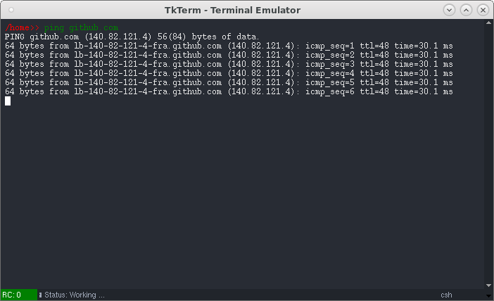

# TkinTerminal - Terminal Emulator
A fully functional terminal emulator built on Tkinter library - perform all basic commands of a terminal

<p align="center">

</p>

Under the hood it executes commands using Python's *subprocess* module and spawn as a thread. Pressing `Ctrl-C`will terminate current running command. Supports Unix shells (`bash` and `C-Shell`) and Window's Command Prompt (`cmd.exe`) commands. 

## Features
- Compatible with Windows and Unix systems
- Return Code (RC) of previous run commands is shown at the bottom status bar
- Status message: IDLE or Working to show if current process is executing
- Ctrl-C to kill current running process
- Unix-like tab completion on files and directories

## Requirements
The Tkinter GUI library is built into Python, so no additional components are needded.

Requires Python version 3 and above.

## Usage
Simply run the script with
```shell
$> python tkinterminal.py
```

---

## Integration (TODO)
